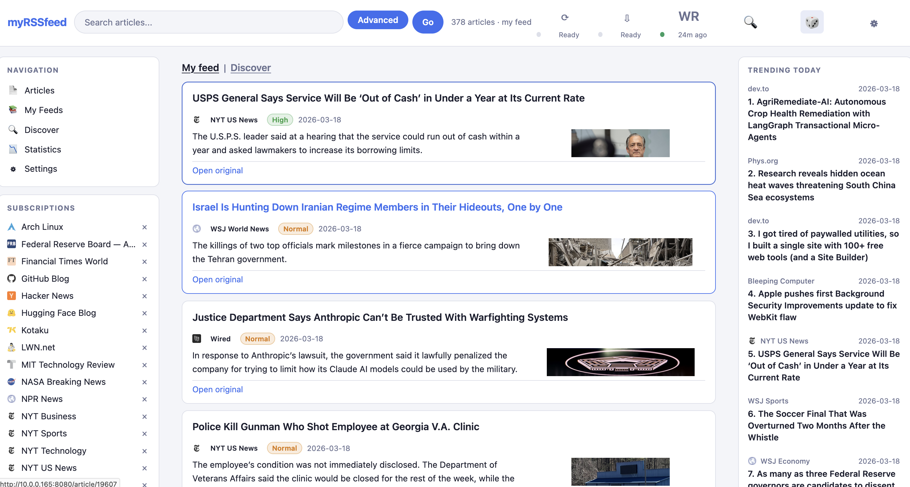

# myRSSfeed

myRSSfeed is a self-hosted RSS reader built with FastAPI + SQLite, designed to run well on a Raspberry Pi and be reachable on your local network.

## Current capabilities

- Subscribe, unsubscribe, rename, and browse feeds from a local web UI.
- Discover feeds from a curated catalog and detect RSS/Atom links from a pasted URL.
- Read entries with filters for search query, date range, quality level, feed scope, themes, and sort order.
- Mark articles read, like/unlike entries, and open article detail pages.
- Run a lightweight background pipeline that fetches feeds, prunes old entries, scores entry quality, and applies heuristic theme labels.
- Trigger refreshes manually, check refresh status, and view recent service logs from the browser.
- Optionally ingest newsletter emails over IMAP, with manual sync and scheduled polling when enabled.
- Run WordRank manually to recompute recommendation scores from liked articles.

## Core offering

myRSSfeed is currently optimized around a small, Pi-friendly feature set:

- Reliable local RSS aggregation
- Fast browsing and filtering
- Lightweight quality ranking
- Heuristic theme labeling
- Optional newsletter ingest

Older experimental features such as visualization maps, full-page article scraping, and LLM-heavy enrichment are not part of the current core product.



## Install

### Raspberry Pi / Debian (recommended)

This sets up a virtual environment, installs dependencies, and configures a `systemd` service (`myrssfeed`) on port `8080`.

```bash
git clone git@github.com:josephkaiser/myrssfeed.git
cd myrssfeed
bash install.sh
```

After install, open the URL printed by the script. If mDNS is available, this often works with your Pi's existing hostname:

- `http://<current-pi-hostname>.local:8080`

`install.sh` does not rename the machine.

Logs endpoint:

- `http://<host>:8080/api/logs`

### Local/manual run (any OS)

```bash
git clone git@github.com:josephkaiser/myrssfeed.git
cd myrssfeed
python3 -m venv .venv
source .venv/bin/activate
pip install -r requirements.txt
PYTHONPATH=src python -m myrssfeed
```

Default app URL:

- `http://localhost:8080`

Compatibility note:

- `python main.py` still works from the repo root.

Dependency note:

- `requirements.txt` is intentionally pinned to exact versions so local installs and Raspberry Pi installs stay on the same runtime stack.

## Service management (Linux/systemd)

```bash
sudo systemctl status myrssfeed
sudo systemctl restart myrssfeed
sudo systemctl stop myrssfeed
sudo systemctl start myrssfeed
sudo journalctl -u myrssfeed -f
```

## Deploying updates to the Raspberry Pi

If the Pi already has this repo checked out, deployment is just "update code, rerun the installer, verify the service".

### Git-based deploy on the Pi

SSH into the Pi, pull the latest code, and rerun the install script. `install.sh` is safe to rerun and will restart the `myrssfeed` service when needed.

```bash
ssh <pi-user>@<pi-host>
cd /path/to/myrssfeed
git pull
bash install.sh
sudo systemctl status myrssfeed
```

Then open:

- `http://<current-pi-hostname>.local:8080`
- or `http://<pi-lan-ip>:8080`

Useful verification commands:

```bash
sudo journalctl -u myrssfeed -n 120 --no-pager
curl http://localhost:8080/api/refresh/status
```

### Rsync-style deploy

If you deploy by copying the working tree from another machine instead of pulling on the Pi, stop the service first, sync the repo, then rerun the installer:

```bash
ssh <pi-user>@<pi-host> 'sudo systemctl stop myrssfeed'
rsync -avz --progress \
  --exclude='.git/' \
  --exclude='.venv/' \
  --exclude='node_modules/' \
  --exclude='__pycache__/' \
  --exclude='.pycache_compile/' \
  --exclude='.DS_Store' \
  --exclude='certs/' \
  --exclude='feeds/' \
  --exclude='logs/' \
  /path/to/local/myrssfeed/ <pi-user>@<pi-host>:/path/to/myrssfeed/
ssh <pi-user>@<pi-host> 'cd /path/to/myrssfeed && bash install.sh'
```

This keeps the on-device SQLite database and feed data in place while updating app code and dependencies.

## Web pages

- `/` main feed view
- `/article/{entry_id}` article details
- `/feeds` subscribed feeds
- `/discover` discover/catalog page
- `/add-feed` add-feed helper page
- `/settings` runtime settings
- `/stats` stats dashboard

## API (most used)

- `GET /api/feeds` list subscribed feeds
- `POST /api/feeds` add a feed
- `DELETE /api/feeds/{feed_id}` unsubscribe a feed
- `GET /api/entries` list entries with filters/pagination
- `POST /api/entries/{entry_id}/read` mark read
- `POST /api/entries/{entry_id}/like` toggle like
- `GET /api/search` live article search suggestions
- `POST /api/refresh` trigger background refresh
- `GET /api/refresh/status` check refresh status
- `GET /api/settings` and `POST /api/settings` read/update settings
- `POST /api/discover/detect` detect RSS/Atom from a URL
- `POST /api/newsletters/sync` and `GET /api/newsletters/status` manage newsletter ingest
- `POST /api/wordrank` and `GET /api/wordrank/status` manage WordRank
- `GET /api/logs` view recent logs

For implementation details, see `src/myrssfeed/app.py`, `src/myrssfeed/scripts/scheduler.py`, and `src/myrssfeed/utils/helpers.py`.
